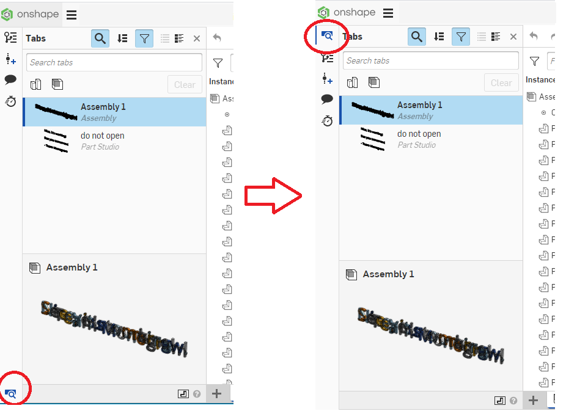

This is a Chrome plug-in to Move the Tab Manager button to top of the left panel in Onshape

To install:

1. Download this repository as a zip file, unzip all files into a single folder
2. Go to chrome://extensions/
3. Enable Developer mode
4. "Load unpacked" and select the folder you downloaded

Note: It is a little janky. Switch between Onshape tabs will make it work if it didn't manage to move the button the first time. 
